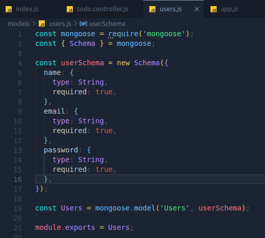
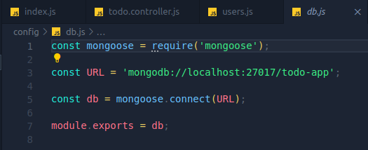

# RANGKUMAN WEEK 3 BACK-END BOOTCAMP

## MongoDB

- #### Apa itu Mongodb

&nbsp;&nbsp;&nbsp;&nbsp;MongoDB adalah database noSQL (Not Only SQL). noSQL yaitu merupakan sistem manajemen data non-relasional yang tidak memerlukan skema tetap, yang berarti kita bebas dalam mengelolah data didalamnya dan tidak memerlukan query seperti layakknya database yang menggunakan SQL seperti MySQL, MariaDB dan lain sebagainya. MongoDB menyimpan data datanya didalam dokumen dengan format JSON (Javascript Object Notation).

Kelebihan dan kekurangan menggunakan database MongoDBs:

**Kelebihan:**

    - Tidak memerlukan sebuah table
    - Performa lebih cepat
    - [more]("https://alronz.github.io/Factors-Influencing-NoSQL-Adoption/site/MongoDB/Results/Strengths%20and%20Weaknesses/")

**Kekurangan:**

    - Ada batasan memory sebanyak (16 mb /document)
    - Menggunakan banyak memory
    - [more]("https://alronz.github.io/Factors-Influencing-NoSQL-Adoption/site/MongoDB/Results/Strengths%20and%20Weaknesses/")

- #### SQL vs noSQL

  |                  | noSQL                                     |                SQL                 |
  | ---------------- | ----------------------------------------- | :--------------------------------: |
  | INTENDED PURPOSE | Specifice use cases                       |          General Purpose           |
  | API              | SQL not require                           |            SQL require             |
  | DATA MODEL       | Various, depending on NoSQL database type | Tables with fixed rows and columns |
  | SCHEMA           | Flexibel                                  |               Rigid                |
  | SCALABILITY      | Horizontal scale out                      |          Vertical scal up          |
  | DATA INTEGRITY   | Base                                      |                ACID                |

see here for [more](https://www.techtarget.com/searchdatamanagement/definition/NoSQL-Not-Only-SQL)

- #### Apa itu Database, collection dan document di MongoDB

&nbsp;&nbsp;&nbsp;&nbsp;Pada dasarnya Database di MongoDB biasa berisikan kumpulan collection atau tempat penyimpanan collection. kalau pada MySql memiliki table lain halnya di MongoDB, pada database ini memiliki yang namanya collection, collection sendiri mampu menyimpan data-data berupa document. Document ini digunakan untuk menyimpan data-data real kita.

- #### Mongodb Schema

&nbsp;&nbsp;&nbsp;&nbsp; MongoDB pada dasarnya hanya memiliki 2 Schema yaitu Embedding dan Referencing, untuk melakukan relasi kita bisa menggunakan Schema Referencing, Scheman ini samahalnya seperti menggunakan query pada database relasional. beda dengan scheman Embedding yang dimana data disatukan didalam satu dokumen [more](https://www.mongodb.com/developer/products/mongodb/mongodb-schema-design-best-practices/).

contoh schema Embed:

```json
{
    _id: 1,
    email: “arsil@gmail.com”,
    name: muhammad arsil alhabsy,
    address: {
    street: “Lrg. Menara Tokyo”,
    city: “kiev”,
    state: “Sulawesi”,
    country: “Indonesia”,
    zip: “19191”,
    }
}
```

contoh schema referencing:

```json
> db.user.findOne()
{
    _id: 1,
    email: “arsil@gmail.com”,
    name: muhammad arsil alhabsy,
}

> db.address.find({user_id: 1})
{
    _id: 121212,
    street: “Lrg. Menara Tokyo”,
    city: “kiev”,
    state: “Sulawesi”,
    country: “Indonesia”,
    zip: “19191”,
}
```

- #### Basic MongoDB-cli Command

1.  Menggunakan mongodb di terminal

    `mongo`

2.  Melihat Database yang tersedia

    `show dbs`

3.  Menggunakan database

    `use <nama database>`

4.  Membuat Collection

    `db.createCollection(<nama collection>)`

5.  Menambahkan 1 document atau lebih

    `db.<nama-collection>.insertOne(<data json>)`
    `db.<nama-collection>.insertMany(<data json>)`

6.  Melihat seluruh data pada document dengan method `find()`

    `db.<nama-collection>.find()`

## Mongoose

- #### Apa itu Mongoose

&nbsp;&nbsp;&nbsp;&nbsp;Kalau sebelumnya sequalize adalah ORM untuk database relasional seperti MySQL, MariaDB dan lain sebagainya. Mongoose hadir sebagai ODM (Object Document Mapper) untuk MongooDB database yang berbasis document database noSQL

- #### Menggunakan Monggose

1.  Install mongoose

    `npm i mongoose`

2.  Membuat model schema

    

3.  Connect database local

    
